# Homework 2

Manohar Vellala

CS 620, Fall 2023

## Part 1: Data Cleaning


The raw dataset contains 1784 rows and 5 columns: **What kind of pet
this**, **pet’s full name**, **pet’s everyday name**, **pet’s age** and
**pet’s bread**.

In this homework, the data is cleaned using OpenRefine, and this report
details the steps followed for cleaning. The data is imported into
OpenRefine using the GitHub
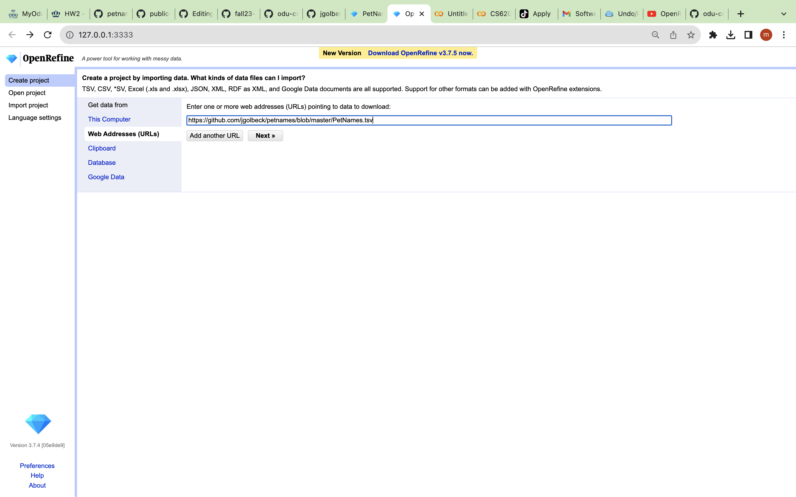

### Column: “What kind of pet is this”

First, **cluster and edit** feature is used to combine some of the
choices which have similar names
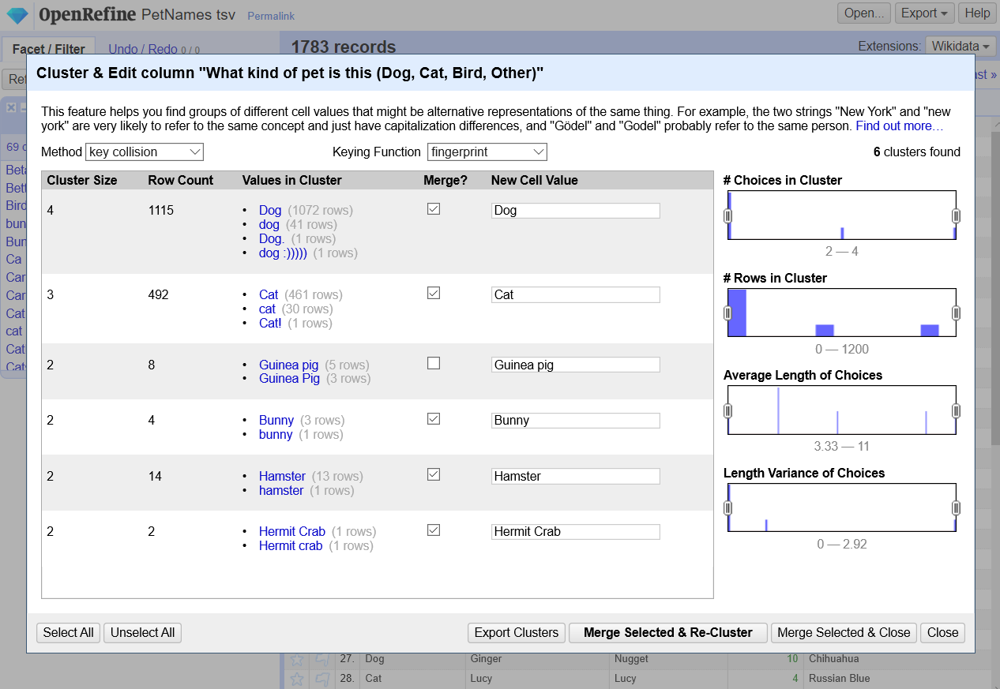

Below steps are followed to clean the names using the text facet.

1.  **Beta fish** is changed to **Betta fish** due to spell differences
    and the change is made manually as it requires only one change.

2.  **Betta Fish** is a type of fish and misplaced in **What kind of pet
    is this**. Moreover, **Fish** was placed in **Pet’s Breed** column.
    First, all the values in the **Pet’s Breed** cells are changed to
    **Betta Fish** using below **GREL** commands.

    ```r
    if(not(value=="test"),'Betta Fish',value)
    ```

3.  In the next step, **Betta fish** is renamed to Fish in **What kind
    of pet is this**

4.  The **Ca** and **Car** names are changed to **Cat**

5.  **Card Board Poster** is removed because it is not a pet.

6.  **Cats** has multiple pets and **Split multi-valued cells** feature
    is used to split into multiple rows.

7.  **Chincilla (other)** is changed to **Chinchilla** Manually

8.  **dlg**, **god**, **Dig**, and **Doggo** are changed to **Dog**
    because the **Pet’s Breed** in this choice is the name of a dog
    breed.about:blank#blocked

9.  **dog,dog,dog,cat** is spitted into multiple rows as it contains 4
    pets in a single row.

10. **Goldfish** is placed in **What kind of pet is this** instead of in
    **Pet’s breed** similar to **Betta Fish**. GREL commands are used to
    fill **Goldfish** in **Pet’s breed** and the name is changed to
    **Fish** in **What kind of pet is this**

    ```r
    if(not(value=="test"),'Goldfish',value)
    ```

11. **Katze**, **Kitten** and **Kitty Meow** are different names of a
    cat in different languages and they are changed to **Cat**

12. **Luna** is removed as it does not belong to any pet.

13. Following conversion are made based on the information in the other
    columns.

<!-- end list -->

- **Mona** to **Dog**.

- **Phoebe** to **Dog**.

- **Pit bull** to **Dog**.

- **Puppy** to **Dog**.

- **Roomba** to **Robot**.

- **Server** to **Other**.

- **Sog** to **Dog**.

- **(Other (fish))** to **Fish**.

- **Other- guinea pig** to **guinea pig**.

- **Other: bees** to **Bees**.

- **Other: prairie dog** to **dog**.

- **Other: snake** -\> **Snake**

<!-- end list -->

14. **Leopard gecko** is the breed name for lizard and it is renamed as
    **Lizard**.

15. Some of the electronics like **Rhoomba** are clustered into Unknown
    and they are removed as they are not pets.

### Pet’s Full Name & Pet’s everyday name

The pet names are unique and there can be differences in spelling.
Limited operations are used to clean the data in these columns. For
**Pet’s Full name**, **cluster and edit** is used to combine names which
has a difference in the letter case. Merging is done using two **Keying
Function** types: **fingerprint** and **ngram-fingerprint**. Similarly,
merging for **Pet’s everyday name** column is made using **cluster and
edit** and cell values with **null** are modified to **Unknown**

### Pet’s age

To visualize the details of choices in this column, **Numeric facet** is
used and it contains **Non-Numeric** values. To visualize choices in the
**Non-numeric** values, **Text Facet**

Steps followed for cleaning the values in this column is listed below:

1.  To combine some of the values, **cluster and Edit** is used and
    merged

2.  Some values have years and special characters. They are removed
    using below GREL commands executed one after the other.

    ```r
    value.replace("years","").replace("year","").replace("ish","").replace("yesrs","").replace("?","").replace(" ","").replace("½",".5")
    value.replace("old","").replace("1/2",".5")
    ```

3.  After the above operation, some of the numerical values are
    considered as a string. These values are converted to numbers using
    **Edit cells -\> Common transforms -\> To number**.

4.  Months are converted to year using below GREL commands

    ```r
    toNumber(value.replace("months","").replace("month","").replace("mos","").replace("mo","").replace(" ",""))/12.0
    ```

5.  All the strings are converted to numbers using **Edit cells -\>
    Common transforms -\> To number** operation.

### Pet’s breed:

The selected choices in the above figure are converted to a single name
using below GREL code.

```r
if(not(value=="test"),"Mixed",value)
```

The entire data cleaning of all the columns took around 300 operations.

## Part 2

In this part, the cleaned data is used to answer the below questions.

### 1\. How many types (kinds) of pets are there?

Text facet is used to visualize different kinds of pets and the number
of pets is **33** as shown in the below figure.

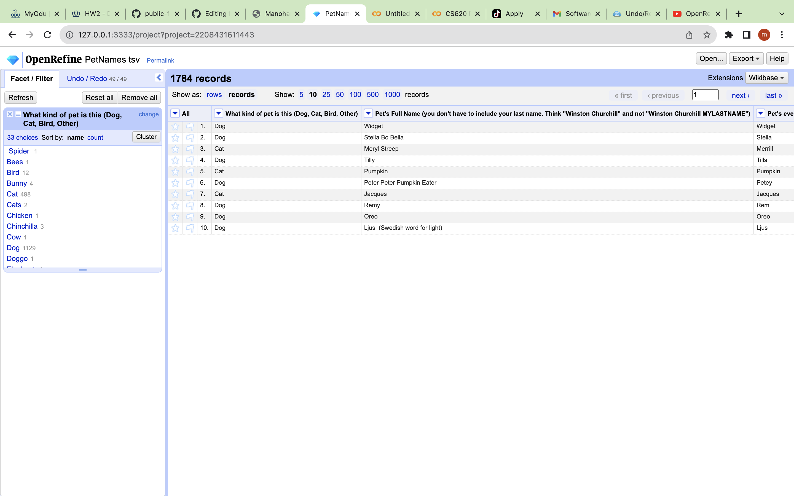

### 2\. How many cats?

The text facet shows that the number of cats is **489** as shown in the
below figure.

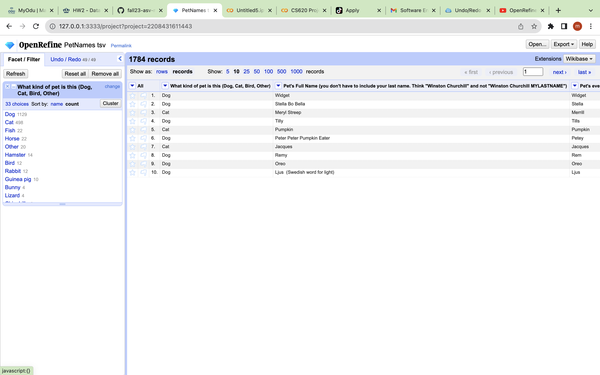

### 3\. How many breeds of cats?

There are **114** cat breeds as shown in
the below figure.

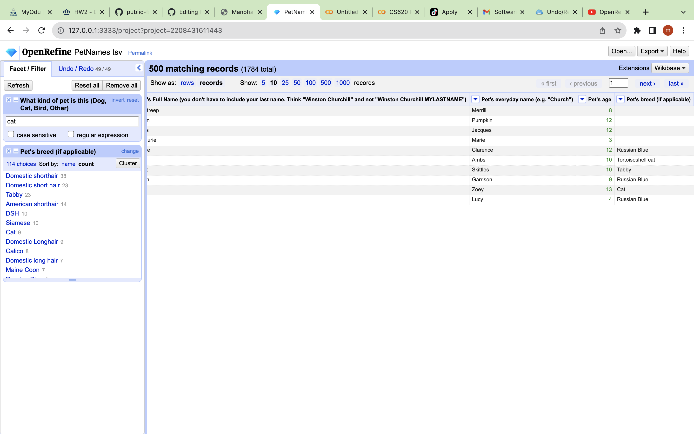

### 4\. What's the most popular cat breed? How many cats are in that breed??

The most popular cat breed is **Domestic shorthair**.
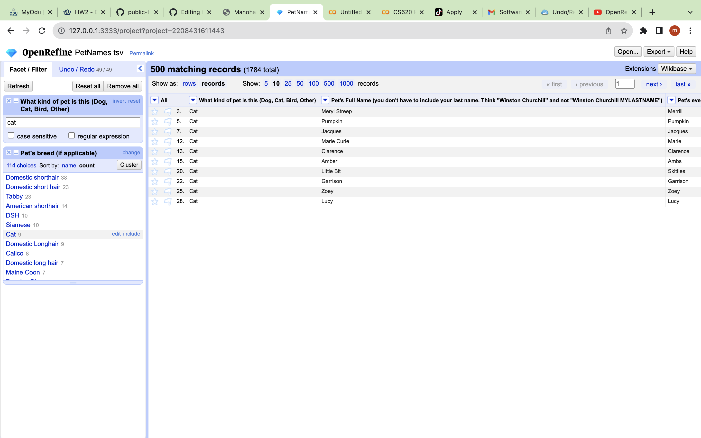

### 5\. What's the age range of the cats?

The data of cats are sorted based on **Pet’s age** and the maximum age
of a cat is **25** and the minimum age of a cat is almost **0**.

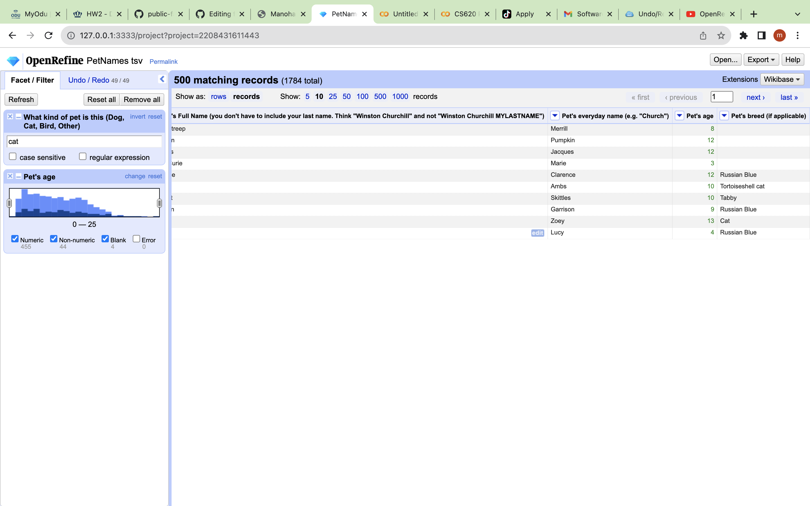

### 6\. What's the age range of the rabbits? (Don't forget to look for bunny, too.)

The age range of rabbits is between **0-25**.

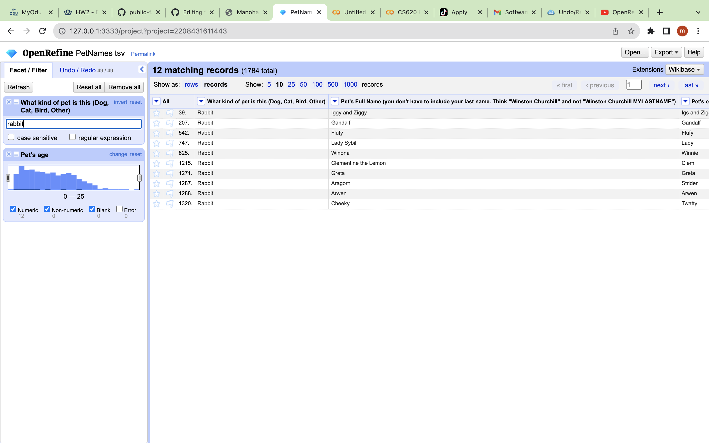

### 7\. What is the oldest pet? Give the pet's name, kind, and age.

The oldest pet is **Cat** with an age of **24** and the name Bruce Springsteen

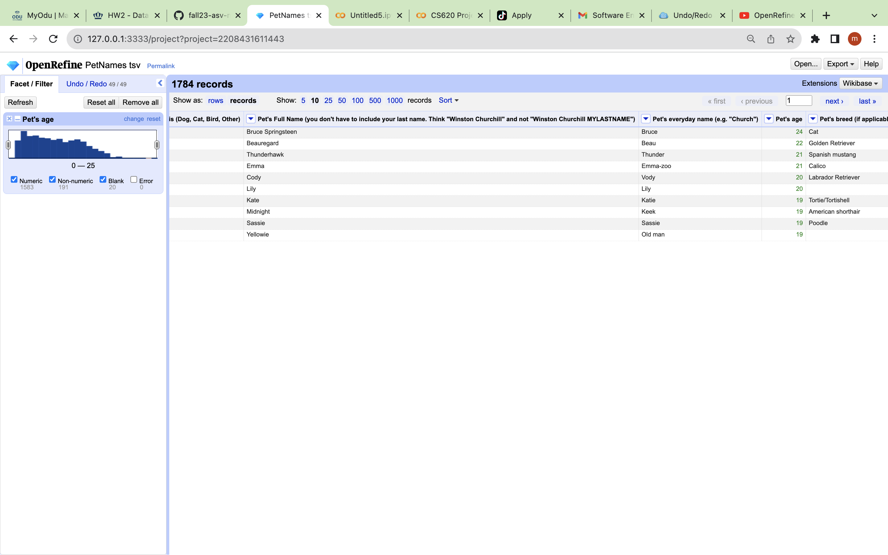

### 8\. What are the top 5 most popular dog breeds? List the breed and number.?

The list is as shown below:
Golden Retriever 158
Mutt 35
Labrador Retriever 24
Beagle 19
Chihuahua 17

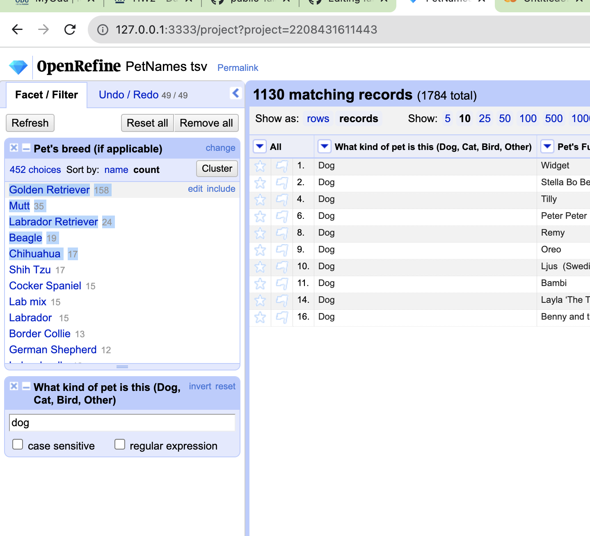

### 9\. What's the most popular everyday name for a dog?.

The most popular everyday dog name is **Daisy** as shown in the below
figure.

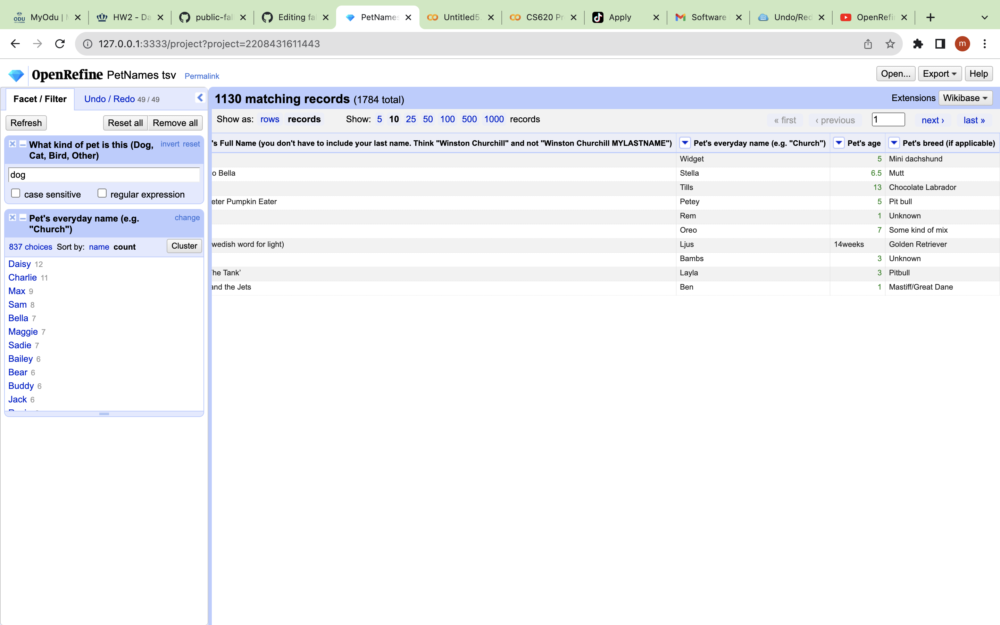

### 10\. What's the most popular full name any pet?

The most popular full name is Bella

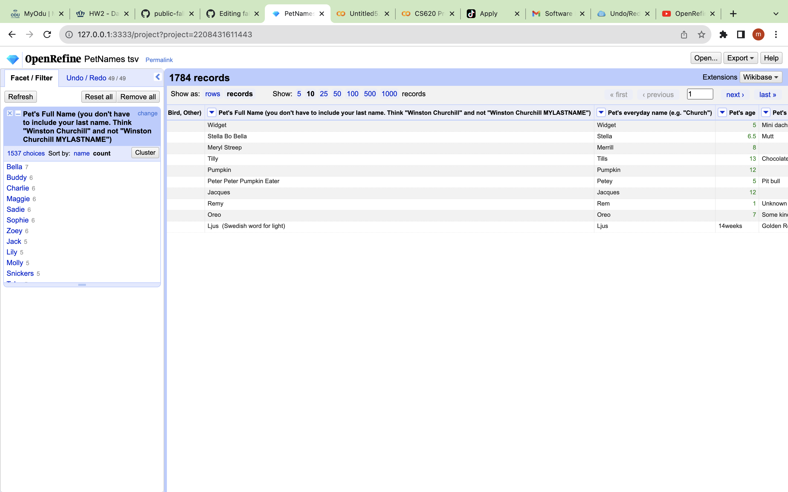

## References

1.  Data source from github: <https://github.com/jgolbeck/petnames>
2.  OpenRefine Tutorial:
    <http://web.archive.org/web/20190105063215/enipedia.tudelft.nl/wiki/OpenRefine_Tutorial>
3.  General Refine Expression Language (GREL) reference :
    <https://github.com/OpenRefine/OpenRefine/wiki/General-Refine-Expression-Language>
