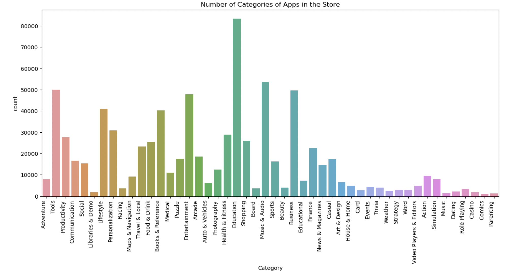
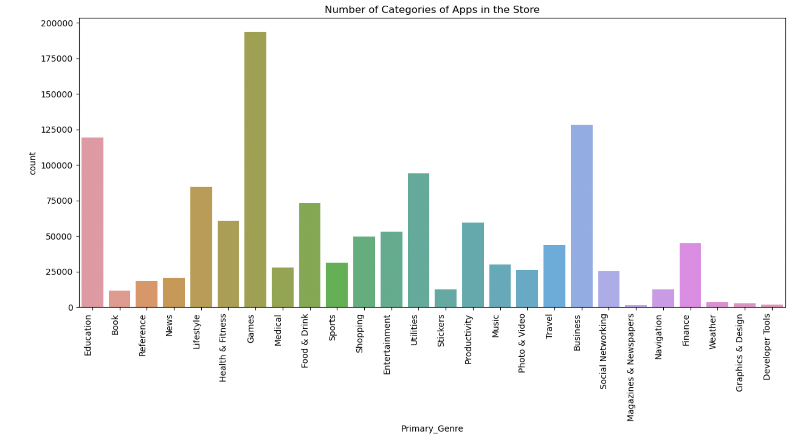
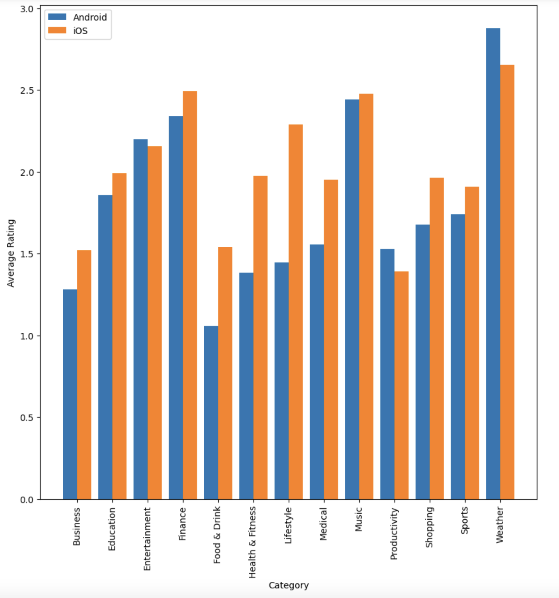
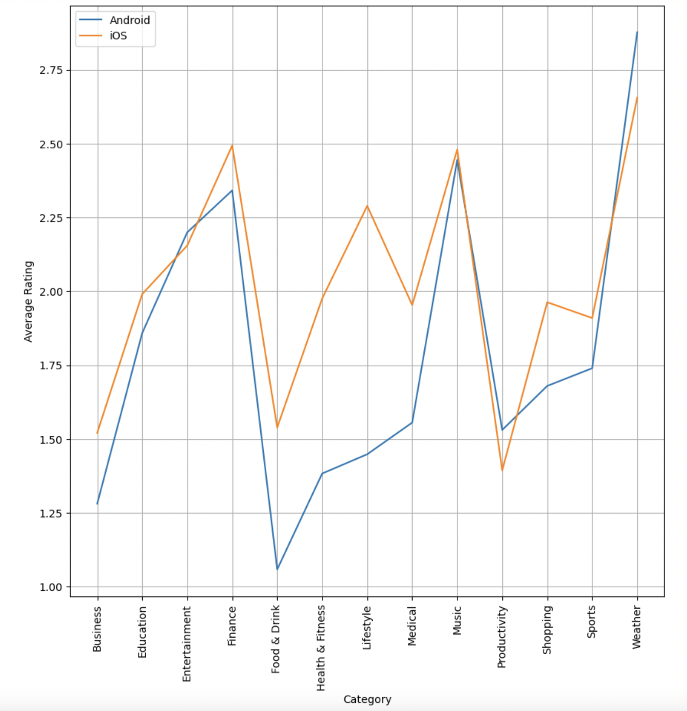
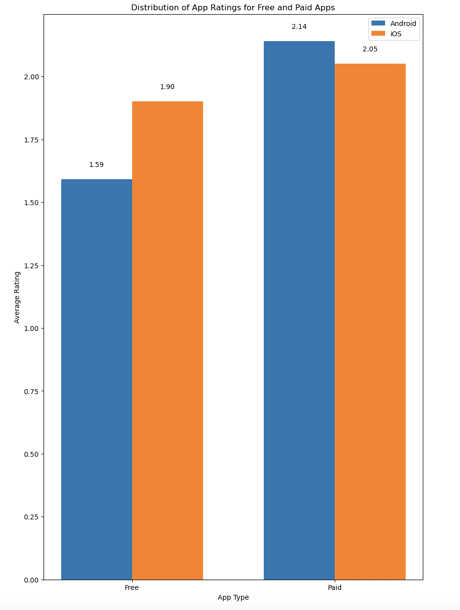

# Comparative Analysis of Android and iOS Apps

Manohar Vellala
2023-04-20

### Project Details - Android vs iOS Apps

In recent years, there has been a significant surge in the adoption of smartphones. The two leading platforms, Android and iOS, dominate the market due to their user-friendly interfaces and robust computational capabilities, catering to a vast range of applications. This project involves a comprehensive comparison of Android and iOS apps sourced from their respective app stores. By extracting and analyzing data, we aim to discern disparities between these platforms in terms of downloads, size, ratings, customer reviews, pricing, and other factors. This analysis provides valuable insights into user preferences for the same apps on Android and iOS.

The objectives of this project are to: \* Clean and Perform exploratory
data analysis on Android and iOS apps dataset.

- Practice data wrangling.

- Analyze the android and apple app data to do categorical analysis and
  to determine the relationship between apps rating, reviews and
  downloads.

- Identifying Same apps in both datasets and perform the EDA to
  determine the user intrests on same app.

- Create visualizations that explains our insights on data.

The objective of this study is to examine the features of Android and iOS applications collectively. The aim is to formulate market solutions for business developers and app entrepreneurs by identifying successful apps in both platforms and analyzing the features that contributed to their success in the market.

### Datasets

[Android Dataset - First
Dataset](https://github.com/gauthamp10/Google-Playstore-Dataset) (2.3
million data)

Dataset taken through github, they collected the data with the help of
Python and Scrapy running on a cluster of cloud virtual machines. The
data was collected from Google play store on June 2021.
<https://github.com/gauthamp10/Google-Playstore-Dataset>

**Description of Android Dataset:**

We are using a csv file “android.csv”. Before getting into actual EDA,
we will familiarize with the variables:-

- App Name - Name of the App
- App Id - Id of the APP
- Category - Category under which the App falls.
- Rating count - Application’s rating on playstore
- Installs - Number of Installs of the App
- Minimum Installs - Maximum Installation Count of the App
- Maximum Installs - Minimum Installation Count of the App
- Free - Boolean (True/False)
- Price - Price of the app (0 if it is Free)
- Reviews - Number of reviews of the App.
- Size - Size of the App.
- Minimum Android - Supported Android Version
- Developer Id - ID of the Developer
- Developer Website - Developer webite
- Developer Email - Developer email is mentioned
- Released - App Release Date
- Last Updated - Date when the App was last updated
- Content Rating - Appropiate Target Audience of the App
- Privacy Policy - Link for the Privacy Policy Agreement
- Ad Supported - Is App is Ad Supported (Boolean)
- In App Purchases - Is App has in app purchases (Boolean)
- Editors Choice - Is app showed in Editors Choice (Boolean)
- Scraped Time - Data Scraped Time

[IOS Dataset - Second
Dataset](https://github.com/gauthamp10/apple-appstore-apps) (1.2 million
data)

IOS Dataset taken through github, they collected the data with the help
of Python and Scrapy running on a cluster of cloud virtual machines. The
data was collected from Apple AppStore on October 2021.
<https://github.com/gauthamp10/apple-appstore-apps>

**Description of IOS Dataset:**

We are using a json file “ios.json”. Before getting into Actual EDA, we
will familiarize with the Variables.

- App_Id: This column name represents the application unique Id
- App_Name: This column name represents the application name.
- AppStore_Url: This column name represents the application Store Url.
- Primary_Genre: This coloumn name represents the primary Genre under
  which the application falls.
- Content_Rating: This column name represents the Application content
  rating.
- Size_Bytes: This column name represents the application size (in
  bytes).
- Required_IOS_Version: This column name represents Required IOS version
  of the Application
- Released: This column name represents when the application is released
- Updated: This column name represents when the application is updated
- Version:This column name represents the application current version
- Price: This column name represents the price of the application
- Currency: This column name represents the Currency of the application
- Free: This column name represents whether the application is free or
  not to download
- DeveloperId: This column name represents the DeveloperId of the
  application
- Developer: This column name represents the application Developer name
- Developer_Url: This column name represents the developer Url of the
  application.
- Developer_Website: This column name represents the website of the
  developer of the application
- Average_User_Rating: This column name represents the Average users
  Rating on the application
- Reviews: This column name represents the end users Reviews on
  application
- Current_Version_Score: This column name represents the Current version
  score on the application
- Current_Version_Reviews: This column name represents the end users
  Reviews on current version of the application

## Exploratory Data Analysis (EDA)

The total EDA Process is done using Python, Jupyter Notebook is included
in the documents named as **AndroidvsiOS_Notebook.ipynb**.

### Data Manipulation or Transformations on the First Data set (Android)

- I commenced by eliminating unnecessary columns such as "App Id," "Minimum Installs," "Maximum Installs," "Currency," "Minimum Android," "Developer Id," "Developer Website," "Developer Email," "Released," "Last Updated," "Privacy Policy," "Ad Supported," "In App Purchases," "Editors Choice," "Scraped Time," and "Rating Count."

- Subsequently, I examined the dataset for null values and noted a significant presence of NaN (missing) values, particularly in the Rating and Rating Count columns.

- Handling missing data can be approached through two methods: either dropping the missing values or imputing them. The decision on which method to employ depends on the specific case. It might be acceptable to allow a certain proportion of missing values, but beyond a certain threshold, removing the variable from analysis could be considered. The determination often hinges on the perceived amount of information retained by the variable in question, and this evaluation varies depending on the specific circumstances.

- If the information contained in the variable is not that high, you can
  drop the variable if it has more than 50% missing values. There are
  projects / models where imputation of even 20 - 30% missing values
  provided better results.

- We can see that, almost 7913 of the rows have null values in place of
  Ratings. Hence we took the mean of the Rating column and filled up the
  null values.

- In case of other variables like, Installs, Size etc, the number of
  null values are too negligible that one can either drop it or fill it.
  I just used ‘fillna’ command with forward fill to remove null values
  in the rest of the columns.

- In this way, all the null values have been removed.

- Then the data has been cleaned in the “Installs” column by removing
  the special characters “+” and “,” and storing them in a new column
  called “Install1”. The data is then stored in a new column called
  “Install” once the remaining commas have been removed from the
  “Install1” column.

- Also the letters “M” and “k” have been replaced with empty strings in
  order to remove them from the “Size” column after removing any leading
  or trailing whitespace from each value. Overall, “Installs” and “Size”
  columns of a pandas DataFrame are cleaned and standardized for further
  analysis or modeling.

- Next, I have checked for the datatypes and coverted few categorical
  columns- ‘Rating’, ‘Price’, ‘Install’ to numerical. “apply()” method
  is used with a lambda function to convert the values in the column to
  integer or float and assign them to the corresponding columns. Also,
  Used a list comprehension to transform the “Install” column values.
  For each value in the column, checked whether it is a numeric string
  using the “isnumeric()” method. If it is, the value is converted to an
  integer using the “int()” function. Otherwise, the original value is
  kept.

- In this way, Android Dataset has been updated.

### Exploration of First Dataset (Android Datset)

### Number of categories of apps in the store and their respective count.

## Bar Chart:

- Idiom Used - Bar Chart

- Marks Used - Line (to encode attributes)

- Channels Used - X-axis, Y-axis and color (to encode attributes)

- Data Attributes, their attribute types, and channels used to encode
  those attributes

1.  Category - Categorical - Horizontal position (X-axis)
2.  Count - Quantative - Vertical Position (Y-axis)
3.  Count - Quantative - Color

- A bar chart is a type of chart that represents data with rectangular
  bars of lengths proportional to the values they represent.

- Bar charts are commonly used to compare and contrast various data
  points across several categories or groupings, such as quantities,
  frequencies, or percentages. The height or length of each bar reflects
  the size of the data being shown, and the bars can be horizontally or
  vertically oriented.

- To further distinguish between various categories or sub-groups, the
  bars can be colored or patterned. Labels or values can be be placed to
  each bar to provide further details.

- From the above bar chart, we can see that the top most category is
  Education followed by Music&Audio, Tools, Business and Entertainment.

### Distribution of free and paid Android applications in terms of percentage.

## Pie Chart

- Idiom Used - Pie Chart

- Marks Used - Sectors (to encode attributes)

- Channels Used - color (to encode percentage values)

- Data Attributes, their attribute types, and channels used to encode
  those attributes

1.  Percentage - Quantative - Color

- A pie chart is a circular graph that represents data as slices of a
  pie.

- Pie charts are commonly used to show the distribution or composition
  of a data set, and can be useful for visualizing proportions,
  percentages, or fractions. However, they can also be misleading if the
  slices are not accurately sized or labeled, or if there are too many
  categories or small values to display effectively.

- In general, pie charts are best suited for displaying data with a
  small number of categories and a clear pattern of distribution.

- From the above pie chart, we can say that free applications of android
  are of 98% and the paid applications of android are of 2%.

### Data Manipulation or Transformations on the Second Data set (iOS)

- In order to clean the IOS data, at first checked for null values and
  cleaned and explored the IOS data to get it into a format for
  analysis.

- The updated and released columns have been seperated into two
  different columns (Date and Time seperated). Then we got 4 additional
  columns - ‘Updated_Date’, ‘Updated_Time’, ‘Released_Date’ and
  ‘Released_Time’.

- Next, the unnecessary columns have been removed such as
  ‘AppStore_Url’, ‘Updated_Time’, ‘Released_Time’, ‘Released’,
  ‘Updated’, ‘DeveloperId’, ‘Developer_Url’, ‘Developer_Website’,
  ‘Current_Version_Score’, ‘Current_Version_Reviews’, ‘Developer’ and
  ‘Currency’.

- Then, the special characters have been removed from the ‘Content
  Rating Column’. This step made it easier to analyze, clean, and
  integrate dataset. This is done using Python list comprehension that
  modifies the values in the “Content_Rating” column of a Pandas
  DataFrame called “df”. More specifically, it removes any leading or
  trailing whitespace characters from each value in the “Content_Rating”
  column using the “strip()” method, and replaces any occurrence of the
  character ‘+’ with an empty string using the “replace()” method.

- Next, I checked for null values and it is evident that there are no
  null values in the dataset.

- After checking for the bad data in the dataset, found some bad data
  with ‘Content_Rating’ saying that Not yet Rated. So, removed the row
  with ‘Not yet Rated’ from the ‘Content_Rating’ column.

- Next, I checked the datatypes and coverted few categorical columns-
  ‘Content_Rating’, ‘Size_Bytes’, Required_IOS_Verison’, ‘Version’,
  ‘Price’, ‘updated_Date’ and ‘Released_Date’ to numerical. “apply()”
  method is used with a lambda function to convert the values in the
  column to integer or float and assign them to the corresponding
  columns. “pd.to_datetime()” method is used to convert the
  “Updated_Date” and “Released_Date” columns from string to datetime
  format.

- In this way, IOS Dataset has been updated.

### Exploring the Second Dataset (iOS Dataset)

### Number of categories of apps in the store and their count.

## Bar Chart

- Idiom Used - Bar Chart
- Marks Used - Lines
- Channels Used - X-axis, Y-axis
- Data Attributes, their attribute types and channels used to encode
  these attributes.

1.  Primary_Genre - Categorical - Horizontal position (X-axis)
2.  Count - Quantitative - Vertical Position (Y-axis)

- A bar chart is a type of chart that represents data with rectangular
  bars of lengths proportional to the values they represent.

- Bar charts are commonly used to compare and contrast various data
  points across several categories or groupings, such as quantities,
  frequencies, or percentages. The height or length of each bar reflects
  the size of the data being shown, and the bars can be horizontally or
  vertically oriented.

- To further distinguish between various categories or sub-groups, the
  bars can be colored or patterned. Labels or values can be be placed to
  each bar to provide further details.

- From the above bar chart, we can see that the top most category is
  Games followed by Business, Education, Utilities and Lifestyle.

### Number of categories of apps in the store and their count.

## Pie Chart

- Idiom Used - Pie Chart
- Marks Used - Sectors
- Channels Used - color (to encode attributes)
- Data Attributes, their attribute types and channels used to encode
  these attributes.

1.  Percentage - Quantitative - Color

- A pie chart is a circular graph that represents data as slices of a
  pie.

- Pie charts are commonly used to show the distribution or composition
  of a data set, and can be useful for visualizing proportions,
  percentages, or fractions. However, they can also be misleading if the
  slices are not accurately sized or labeled, or if there are too many
  categories or small values to display effectively.

- In general, pie charts are best suited for displaying data with a
  small number of categories and a clear pattern of distribution.

- From the above pie chart, we can say that free applications of iOS are
  of 91.6% and the paid applications of iOS are of 8.4%.

### Merging the IOS and Android Data

Now that the datasets have been cleaned, it is time to merge the
datasets so that the data exploration and data analysis can be performed
next.

- Merged two datasets based on App_Name. From that we will get list of
  apps available in both android and IOS. The resulting DataFrame, which
  is assigned to “df_3”, will contain all the columns from both “df_1”
  (Android dataframe) and “df_2” (IOS dataframe) where the values in the
  “App_Name” and “App Name” columns match. Therefore, total available
  apps in both datasets are 141524.

- The columns from the merged dataset are ‘App_Id’, ‘App_Name’,
  ‘Primary_Genre’, ‘Content_Rating’, ‘Size_Bytes’,
  ‘Required_IOS_Version’, ‘Version’, ‘Price_x’, ‘Free_x’,
  ‘Average_User_Rating’, ‘Reviews’, ‘Updated_Date’, ‘Released_Date’,
  ‘App Name’, ‘Category’, ‘Rating’, ‘Installs’, ‘Free_y’, ‘Price_y’,
  ‘Size’, ‘Content Rating’, ‘Install1’ and ‘Install’.

- Then found the common categories between the “Category” column and the
  “Primary_Genre” column in the dataframe “df_3”, and keeping only the
  rows that are in common in the both columns to make the visualizations
  look better. We get the categories array of \[‘Lifestyle’, ‘Shopping’,
  ‘Education’, ‘Business’, ‘Medical’, ‘Finance’, ‘Health & Fitness’,
  ‘Productivity’, ‘Sports’, ‘Entertainment’, ‘Food & Drink’, ‘Music’,
  ‘Weather’\].

### Genearting Specific Questions and Propose a Chart:

### Question: 1 - What is the distribution of app ratings for Android and iOS apps in each category?

#### Proposed Chart 1: Bar Chart

This question can be answered using Bar Chart. We can group the ratings
by category for both Android and iOS, get a list of all categories, and
create a bar chart with two bars for each category (one for Android and
one for iOS), with different colors for each bar. The x-axis labels will
be the categories, and the y-axis will be the average rating for each
category.

The average app rating for each category for both Android and iOS apps
is displayed in the above bar graph. We can see the distribution of app
ratings for Android and iOS apps in each category by comparing the bar
heights for each category. When the bar for Android in a certain
category is higher than the bar for iOS, it means that Android apps in
that category have received higher ratings than iOS apps. In contrast,
if the iOS bar in a given category is higher than the Android bar, it
means that iOS apps in that category have received higher ratings than
Android apps. So, the distribution of app ratings for Android and iOS
apps in each category can be seen using this bar chart and compared.

#### Recreated Bar Chart with Design Decisions

To recreate the charts as per proposed charts, I used jupyter notebook
which has been included in the documents as
‘AndroidvsiOS_Notebook.ipynb’.

For both Android and iOS apps, aggregated the data by category and
determined the mean rating for each category. Then, using blue bars to
represent Android and orange bars to represent iOS, it makes a bar chart
with categories on the x-axis and average ratings on the y-axis. A
visual representation of the distribution of app ratings for both
Android and iOS apps in each category is provided by the bars, which
display the average rating for each category. For easier reading, the
x-axis labels on the graph are turned 90 degrees and display the various
app categories. The legend identifies which operating system is
represented by which color. Overall, the graph makes it easy to compare
the average ratings of Android and iOS apps in many categories.

- Idiom Used - Bar Chart

- Marks Used - Lines

- Channels Used - X-axis, Y-axis and color (to encode categories of iOS
  and Android)

- Data Attributes, their attribute types, and channels used to encode
  those attributes

1.  Category - Categorical - Horizontal position (X-axis)
2.  Average Rating - Quantitative - Vertical Position (Y-axis)
3.  Platform (iOS and Android) - Categorical - Color

From the above graph, it is clear that, both android and iOS apps in the
weather category have received highest ratings when compared with the
other categories. iOS has received lowest rating in the productivity
category and android has received lowest rating in food & drink
category.

#### Proposed Chart 2: Line Chart

This question can also be answered using Line Chart. We can plot line
chart on the axis for the mean rating of each category for the Android
and iOS platforms, respectively. The x-axis displays the ‘Category’
names, and the y-axis displays the ‘Average Rating’ values. The Android
line is plotted in blue, and the iOS line is plotted in orange. We can
add labels for the x and y-axes and a legend to the plot.

From the above line chart, The average rating of Android and iOS apps
across different categories can be seen as a trend. Between the two
platforms within each category, it clearly compares them. The user may
quickly examine the trends of platforms and determine which has greater
average ratings in each category. This can be useful for determining
which platforms perform better in each category and which categories are
more competitive.

#### Recreated Line Chart with Design Decisions

From this, we can see how app ratings for iOS and Android apps vary by
category. For both Android and iOS apps, I aggregated the data by
category and determined the mean rating for each category. Then, using
blue lines to represent Android and orange lines to represent iOS, it
constructs a line chart with categories on the x-axis and average
ratings on the y-axis. The app ratings trend for both Android and iOS
apps in each category is visually represented by the lines connecting
the mean ratings for each category. For easier reading, the x-axis
labels on the graph are turned 90 degrees and display the various app
categories. The legend identifies which operating system is represented
by which color.

- Idiom Used - Line Chart

- Marks Used - Lines (Dots)

- Channels Used - X-axis, Y-axis and color (to encode platform - iOS and
  Android)

- Data Attributes, their attribute types, and channels used to encode
  those attributes

1.  Category - Categorical - Horizontal position (X-axis)
2.  Average Rating - Quantitative - Vertical Position (Y-axis)
3.  Platform (Android/iOS) - Categorical - Color

 From the above line graph, it appears that the weather
category has the highest average rating for both Android and iOS apps,
while the productivity category has the lowest average rating for iOS
apps and the food & drink category has the lowest average rating for
Android apps.

### Question: 2 - To find the distribution of app ratings for free and paid android and iOS apps

#### Proposed Chart: Grouped Bar Chart

This question can be answered using grouped bar chart. We can create a
single subplot with four bars, one for each combination of free/paid and
Android/iOS. The bar heights can be set to the mean rating for each
group, and the x-axis labels can be rotated for better readability. The
x-axis displays the ‘App Type’ whether it is free or paid, and the
y-axis displays the ‘Average Rating’ values. The Android bar is plotted
in blue, and the iOS bar is plotted in orange. We can add legend to the
plot.

From the above grouped bar chart, The distribution of app ratings for
free and paid Android and iOS apps can be compared. It enables us to
quickly view the average rating for every app type and platform and to
compare the ratings of other app types. For instance, we can check to
see if paid or free apps often receive higher ratings and if there are
any variations in the rating distributions between Android and iOS apps.

#### Recreated Grouped Bar Chart with Design Decisions

To visualize the distribution of app ratings for free and paid Android
and iOS apps, Grouped bar chart has been generated. The ratings data are
separated into four subsets: free Android apps, paid Android apps, free
iOS apps, and paid iOS apps. Afterwards, lists of app rating data are
generated for each group. Then set the width of each bar in a figure
with a single subplot. Furthermore, it changes the x-axis tick labels to
“Free” and “Paid.”

The mean ratings for each subset are then plotted using bars, with the
Android and iOS data side-by-side for easy comparison. The orange bars
show iOS apps, whereas the blue bars show Android apps. Then added
labels, a title, and a legend to the plot, with the title being
“Distribution of App Ratings for Free and Paid Applications” and the
x-axis and y-axis labels shows “App Type (free and paid)” and “Average
Rating” respectively. The legend identifies which operating system is
represented by which color. The chart’s overall comparison of average
app ratings for free and premium Android and iOS apps is very apparent.

- Idiom Used - Grouped Bar Chart

- Marks Used - Lines (to encode attributes)

- Channels Used - X-axis, Y-axis and color (to encode attributes)

- Data Attributes, their attribute types, and channels used to encode
  those attributes

1.  App Type - Categorical - Horizontal position (X-axis)
2.  Average Rating - Quantitative - Vertical Position (Y-axis)
3.  Platform (Android/iOS) - Categorical - Color

From the above grouped bar chart, we can say that the mean rating of
free iOS apps is higher than free android apps. The mean rating of paid
iOS apps is lower than the paid android apps.

### Conclusion and Final Thoughts

My final visualizations include a Line Chart illustrating the average ratings of Android and iOS apps across various categories. This chart reveals platform trends and identifies which platform has a higher average rating in each category. Notably, the weather category exhibits the highest average rating for both Android and iOS apps, while the productivity category shows the lowest average rating for iOS apps, and the food & drink category has the lowest average rating for Android apps. The chart's title, "Distribution of app ratings for Android and iOS apps in each category," aptly captures the comparison between the two platforms within each category.

The second chart, a "Grouped Bar Chart" titled "Distribution of app ratings for free and paid Android and iOS apps," portrays the average ratings for each app type (free and paid) on both platforms. This chart facilitates the comparison of ratings between different app types. Observing the bar graph, it becomes evident that free iOS apps generally have higher mean ratings compared to free Android apps, whereas paid Android apps tend to have higher mean ratings than paid iOS apps. The chosen title and chart style are appropriate, offering a clear comparison of average ratings for free and paid apps across both Android and iOS platforms.

Breaking down the project into three separate assignments allowed me to concentrate on specific tasks extensively, fostering a deeper understanding of the required techniques. Crafting detailed reports for each assignment, including the challenges encountered, provided a comprehensive overview of the completed work. This segmented approach not only enhanced comprehension but also offered a more profound understanding of the concepts compared to a single final project.

### References

- <https://pandas.pydata.org/docs/user_guide/merging.html>

- <https://plotly.com/python/pie-charts/>

- <https://plotly.com/python/bar-charts/#stacked-bar-chart>

- <https://www.journaldev.com/33492/pandas-dropna-drop-null-na-values-from-dataframe>

- <https://www.geeksforgeeks.org/applying-lambda-functions-to-pandas-dataframe/>

- <https://www.markdownguide.org/basic-syntax/>

- <https://pandas.pydata.org/docs/reference/api/pandas.DataFrame.fillna.html>

- <https://pandas.pydata.org/pandas-docs/version/0.23/generated/pandas.core.groupby.DataFrameGroupBy.agg.html>
